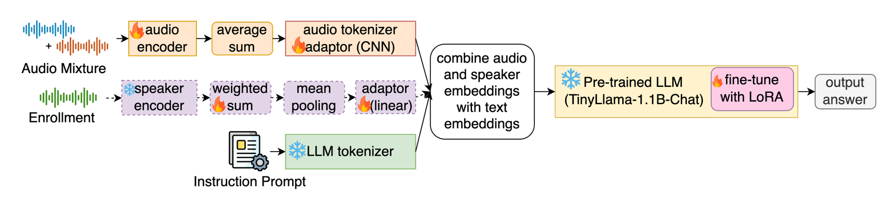

# LittleBeats-LLM

LittleBeats-LLM can reliably and precisely label speaker types and vocalizations for target family members, including infants, parents, and siblings, at a precise temporal resolution of 0.1 seconds, while detecting and distinguishing non-family members as a secondary goal. 

Part of the code in this repository is adapte from [SpeechLLM](https://github.com/skit-ai/SpeechLLM) Github Repository.

The model architecture looks like the following:
<!--  -->

The model is based on a lightweight large language model, [TinyLlama](https://huggingface.co/TinyLlama/TinyLlama-1.1B-Chat-v1.0), and light weight audio encoder, [wav2vec2-LL4300](https://huggingface.co/lijialudew/wav2vec_LittleBeats_LENA), which is pretrained on large-scale 4300-hour of naturalistic home recordings. The encoded audio feature is passed to a CNN tokenizer to align the audio and text modalities. The auxiliary speaker embedding branch is optional, which is helpful when non-family members have higher signal-to-noise (SNR) ratios. More details about the architecture can be found in our paper: TO-DO.

The model inputs an audio file of **16 KHz** and predicts the following possible speaker and vocalization types:
- **infant** : babbling, fussing, laughter, crying
- **female** : child-directed speech, adult-directed speech, laughter, singing
- **male** : child-directed speech, adult-directed speech
- **child** : speech
- **irrelevant female** : speech
- **irrelevant male** : speech

---
## **Usage**

### **Install Required Software**
To install the necessary dependencies, run the following command:

```
pip install -r requirements.txt
```

---

## **Download Corresponding Checkpoints**

### **Model Weights and Checkpoints**

<!-- You can download our released model checkpoints from our [HuggingFace](https://huggingface.co/lijialudew/LittleBeats-LLM) repository.   -->
<!-- To run the model, it's required to download **[wav2vec2-LL4300](https://huggingface.co/lijialudew/wav2vec_LittleBeats_LENA/blob/main/LL_4300/checkpoint_best.pt)**. -->

---

<!-- ### **Available Checkpoints**

| **Model**                                  | **Model Weights**  | **Checkpoint URL**                                             |
|--------------------------------------------|--------------------|---------------------------------------------------------------|
| wav2vec2-LL4300 (Audio Encoder)        | 95M               | [Huggingface](https://huggingface.co/lijialudew/wav2vec_LittleBeats_LENA/blob/main/LL_4300/checkpoint_best.pt)  |

#### **Models Without Speaker Embeddings**
| **Model**                                  | **Model Weights**  | **Checkpoint URL**                                             |
|--------------------------------------------|--------------------|---------------------------------------------------------------|
| Event-based LittleBeats-LLM           | 1.2B              | [Huggingface](https://huggingface.co/lijialudew/LittleBeats-LLM/blob/main/Wav2vec-LL-CNN-tinyllama_event_2_1.2B.ckpt)  |
| Frame-based LittleBeats-LLM (20 frames)| 1.2B              | [Huggingface](https://huggingface.co/lijialudew/LittleBeats-LLM/blob/main/Wav2vec-LL-CNN-tinyllama_frame_20_2s_1.2B.ckpt)    |
| Frame-based LittleBeats-LLM (1 frame)  | 1.2B              | [Huggingface](https://huggingface.co/lijialudew/LittleBeats-LLM/blob/main/Wav2vec-LL-CNN-tinyllama_frame_0.1_2_1.2B.ckpt) | -->


### **Additional Dependencies**
Our model also utilizes **[TinyLlama](https://huggingface.co/TinyLlama/TinyLlama-1.1B-Chat-v1.0)**, which can be downloaded directly via HuggingFace's `transformers` library.


---
## **Data Preprocessing**

The model performs best when input audio consists of **2-second segments**. Below are the required JSON file formats for both **training (with ground-truth labels)** and **inference (without ground-truth labels)**.

### **Preparing Data with Ground-Truth Labels**
For **event-based LB-LLM** or **frame-based LB-LLM (20 frames)**, where longer contextual understanding is needed, the JSON format should include timestamps.

```
# Example Format (Snippets with Labels)
{
  "file_name_58_60": {  // file_name + {starting_time}_{ending_time}
    "wav": {
      "file": "file_to_wav_file",
      "start": 928000,  // e.g., 58 * 16000 (sample rate)
      "stop": 960000   // e.g., 60 * 16000
    },
    "label": {}
  },
  "file_name_60_62": {
    "wav": {
      "file": "file_to_wav_file",
      "start": 960000,
      "stop": 992000
    },
    "label": {
      "CHN_BAB": [  // Event intervals for speaker and vocalization types
        [61.22, 61.55]
      ],
      "CXN_CXN": [
        [61.13, 62]
      ]
    }
  }
}
```

For **frame-based LB-LLM (1 frame)** with finer time resolution, use the following JSON format.
```
# **Example Format (Snippets with Labels)**
{
  "file_name_4.5_4.6": {
    "wav": {
      "file": "file_to_wav_file",
      "start": 56000, # starting_index = (starting_time - 1) * sampling_rate = (4.5-1)*16000=56000
      "stop": 88000, # ending_index = (starting_time + 1) * sampling_rate = (4.5+1)*16000=88000
    },
    "dur": 2.0,
    "chn": "",
    "fan": "FAN",
    "man": "",
    "cxn": "",
    "fan2": "",
    "man2": ""
  },
  "file_name_4.6_4.7": {
    "wav": {
      "file": "file_to_wav_file",
      "start": 57600,
      "stop": 89600
    },
    "dur": 2.0,
    "chn": "BAB",
    "fan": "FAN",
    "man": "",
    "cxn": "",
    "fan2": "",
    "man2": ""
  }
}
```

### **Preparing Data Without Ground-Truth Labels (For Inference Only)**
For inference, prepare a JSON file that includes only the WAV file name and its index.
**We provide python scripts for preparing for inference data only at**
```
data_prep.py
```

#### **Example Format (Snippets for Inference)**
```
{
  "file_name_58_60": {
    "wav": {
      "file": "file_to_wav_file",
      "start": 928000,
      "stop": 960000
    }
  },
  "file_name_60_62": {
    "wav": {
      "file": "file_to_wav_file",
      "start": 960000,
      "stop": 992000
    }
  }
}
```
or

```
{
  "file_name_4.5_4.6": {
    "wav": {
      "file": "file_to_wav_file",
      "start": 56000,
      "stop": 88000
    }
  },
  "file_name_4.6_4.7": {
    "wav": {
      "file": "file_to_wav_file",
      "start": 57600,
      "stop": 89600
    }
  }
}
```


---
## **Train the Model from Scratch**

### Specify Data Paths
Before training, set the following **data path pointers** in the corresponding Python training script:

```
audio_model_path = "path_to_LL4300_checkpoint"
llm_model_path = "path_to_llm_model_checkpoint"
data_path = "path_to_data_json_repository"
# Specify JSON file paths for training and validation datasets, e.g.
train_dataset = LBAudioDataset(
    json_file = "path_to_training_json_file",
    mode='train', 
    apply_1_shot=True,
    include_voc_count=True,
    )
val_dataset = LBAudioDataset(
    json_file = 'path_to_validation_json_file,
    mode='valid',
    apply_1_shot=True,
    include_voc_count=True,
    )
```


**For event-based LB-LLM**, run
```
python train_LB_dict.py
```

**For frame-based LB-LLM (20 frames)**, run

```
python train_LB_frame_2s.py
```
**For frame-based LB-LLM (1 frame)**, run

```
python train_LB_frame_0.1s_2s.py
```


## Inference the model
### Specify Checkpoint Path
```
model_save_path = "path_to_save_model"
best_checkpoint_path="path_to_best_checkpoint" # need to download from previously trained checkpoints
json_file = 'path/to/test/json/file'
ref_rttm_prefix='path/to/test/rttm_prefix' # specify this if diarization error rate is also need to calculated
```

**For Models Without Speaker Embeddings**
**For event-based LB-LLM**, run
```
python test_LB_dict.py
```
**For frame-based LB-LLM (20 frames)**, run
```
python test_LB_dict_2s.py
```
**For frame-based LB-LLM (1 frame)**, run
```
python test_LB_frame_0.1s_2s.py
```

**Inference Models With Speaker Embeddings**

```
python test_LB_frame_spk_emb.py
```
---
## Performance Evaluation
We show **unweighted F1 scores, in percent, of LB-LLM models trained on synthetic dataset at SNR=10 evaluated in the real dataset** below. 
Complete results can be found in our paper.


<!-- ### 

| Model                  | Apply Speaker Network? | Trainable Param | Total Param | RTF  | SPK  | SEC  | CHN  | FAN  | MAN  | CXN  | AVG VC |
|------------------------|------------------------|-----------------|-------------|------|------|------|------|------|------|------|--------|
| Event-based LB-LLM                 | ❌                      | 136M            | 1.2B        | 0.02 | 76.1 | 54.9 | 86.7 | 76.0 | 72.8 | 87.7 | 80.8   |
| LB-LLM (20 frames)      | ❌                      | 136M            | 1.2B        | 0.02 | 83.2 | 59.5 | 90.9 | 86.8 | **86.5** | 90.0 | 88.6   |
|                         | ✅                      | 137M            | 1.3B        | 0.08 | 84.6 | 59.0 | 91.4 | **87.8** | 85.4 | 90.9 | **88.9**   |
| LB-LLM (1 frame)        | ❌                      | 136M            | 1.2B        | 0.4  | **89.4** | 46.3 | **94.7** | 83.7 | 77.8 | **95.2** | 87.9   |
 -->

<!-- **Table Description:**  
- **Model**: Architecture used  
- **Apply Speaker Network?**: Whether speaker embedding networks are applied  
- **Trainable Param** / **Total Param**: Number of trainable and total parameters  
- **RTF**: Real-time factor (time to process 1 hour of audio on an NVIDIA A100 GPU)  
- **SPK**: Speaker type classification
- **SEC**: Secondary speaker detection
- **CHN, FAN, MAN, CXN**: Primary speaker vocalization classification tasks
- **AVG VC**: Average F1 score across CHN, FAN, MAN, and CXN tiers  
- **Bolded values** represent the best results for each dataset. -->

<!-- ## **JSON files to use to reproduce result**

**0.1s frame based json**
- **train**: /work/hdd/bebr/PRJ_LLM_SP25/data/json_mix/train_LB_LENA_voc_snr_5_mix_8_skip3.json
- **dev**: /work/hdd/bebr/PRJ_LLM_SP25/data/json_mix_LB_only/dev_snr_10_mix_8.json
- **test**: /work/hdd/bebr/PRJ_LLM_SP25/data/json_mix_LB_only/test_snr_10_mix_8.json or test_2s_real.json

**2s-based frame/event json**
- **train**: /work/hdd/bebr/PRJ_LLM_SP25/data/json_mix_LLM/train_snr_5_mix_8_2s.json
- **dev**: /work/hdd/bebr/PRJ_LLM_SP25/data/json_mix_LLM/dev_snr_5_mix_8_2s.json
- **test**:/work/hdd/bebr/PRJ_LLM_SP25/data/json_mix_LLM/test_snr_5_mix_8_2s.json -->

## Citations
If you found this recipe helpful, please cite as us
```
TO-DO
```

## Disclaimer
The models provided in this repository are not flawless and may produce errors in speaker and vocalization outputs. Additionally, they may exhibit biases towards English-speaking populations. Please use these models only for their intended purposes and refrain from any misuse that could lead to malicious activities.


## License
<!-- This project is released under the Apache 2.0 license as found in the LICENSE file. The released checkpoints, and code are intended for research purpose subject to the license of 
[wav2vec2-LL4300](https://huggingface.co/lijialudew/wav2vec_LittleBeats_LENA) and [TinyLlama/TinyLlama-1.1B-Chat-v1.0]( https://huggingface.co/TinyLlama/TinyLlama-1.1B-Chat-v1.0) models. -->

